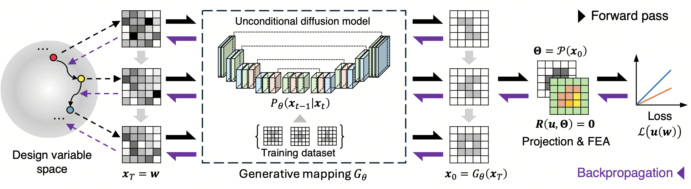

# genopt

This repository contains the code for the paper "Style-constrained inverse design of microstructures with tailored mechanical properties using unconditional diffusion models". The workflow is summarized as follows:


## Structure
- `net/`: Contains the implementation of the unconditional diffusion model architecture and training procedures.
- `fem/`: Contains the finite element analysis code for evaluating the mechanical properties of generated microstructures.
- `helper/`: Contains utility functions for optimization, logging, and visualization.
- `figures/`: Contains figures used in the respository.
- The scripts in the root directory are the implementation for each numerical example in the paper, including 1D Gaussian mixture as well as 2D microstructure design with tailoed homogenized, hyperelastic, and elasto-plastic properties.

## Usage

### Prerequisites
The finite element analysis code is implemented via [JAX-FEM](https://github.com/deepmodeling/jax-fem). Please first follow the [installation instructions](https://deepmodeling.github.io/jax-fem/guide/Installation.html) to install `jax_fem` in a conda environment. All the subsequent procedures should be run in the conda environment with JAX-FEM installed.

### Install dependencies
Some basic dependencies are installed when installing `jax_fem`. Additional dependencies include `flax`, `optax`, `tensorflow`, `tensorflow-datasets`, and `tqdm`. You can follow the official installation instructions to install them or just run:
```bash
pip install -r requirements.txt
```

### Clone the repository
```bash
git clone https://github.com/CMSL-HKUST/genopt.git
cd genopt
```

### Train the diffusion model

For the 1D Gaussian mixture example, run `train_gaussian.py` in `net/flax_gaussian/` to train the diffusion model.

For the [MNIST dataset](https://www.tensorflow.org/datasets/catalog/mnist), run `train_mnist.py` in `net/flax_diffusion/` to train the diffusion model.

For the [2D orthotropic metamaterials microstructure dataset](https://figshare.com/articles/dataset/2D_orthotropic_metamaterial_micorstructrue_dataset/17141975), please first download the dataset and prepare the data following the procedure in the paper. Then run `train_micro.py` in `net/flax_diffusion/` to train the diffusion model.

### Run the optimization examples
After training the diffusion model, you can run the optimization examples provided in the root directory. Each script corresponds to a specific example discussed in the paper. For instance, to run the 1D Gaussian mixture optimization, execute:
```bash
python ddpm_gaussian.py     
``` 

## Citation
If you find this code useful for your research, please consider citing our paper:
```bibtex
to be added
```


